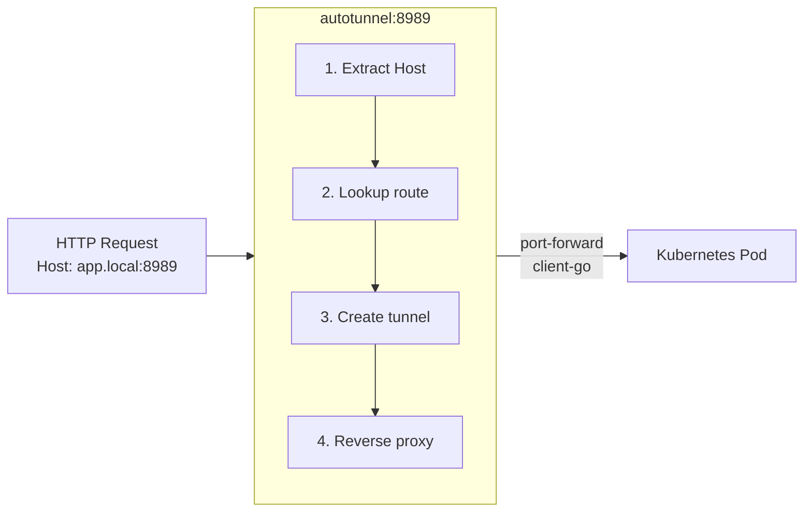

```
██╗      █████╗ ███████╗██╗   ██╗███████╗██╗    ██╗██████╗  ██╗    ██╗
██║     ██╔══██╗╚══███╔╝╚██╗ ██╔╝██╔════╝██║    ██║██╔══██╗ ╚██╗   ╚██╗
██║     ███████║  ███╔╝  ╚████╔╝ █████╗  ██║ █╗ ██║██║  ██║  ╚██╗   ╚██╗
██║     ██╔══██║ ███╔╝    ╚██╔╝  ██╔══╝  ██║███╗██║██║  ██║  ██╔╝   ██╔╝
███████╗██║  ██║███████╗   ██║   ██║     ╚███╔███╔╝██████╔╝ ██╔╝   ██╔╝
╚══════╝╚═╝  ╚═╝╚══════╝   ╚═╝   ╚═╝      ╚══╝╚══╝ ╚═════╝ ╚═╝    ╚═╝
```

# autotunnel - Lazy (_On-Demand_) Port Forwarder & Tunnel

A lightweight, on-demand port-forwarding proxy. Tunnels are created lazily when traffic arrives to the local port and torn down after an idle timeout. Currently supports Kubernetes services and pods.

## Features

- **Lazy port-forwarding**: Tunnels are created only when traffic arrives
- **Automatic cleanup**: Tunnels close after configurable idle timeout
- **Single binary**: No external dependencies at runtime
- **Native Kubernetes client**: Uses client-go (not kubectl subprocess)
- **Multi-context support**: Different services can use different Kubernetes contexts
- **Host-based routing**: Single port serves multiple services based on Host header or TLS SNI
- **TLS passthrough**: HTTPS services work without certificate management
- **Graceful shutdown**: Clean tunnel teardown on SIGINT/SIGTERM

## Installation

### Homebrew (macOS/Linux)

```bash
brew install atas/tap/autotunnel
```

### Running as a Background Service

**macOS (via Homebrew):**
```bash
brew services start autotunnel    # Start and enable auto-start on login
# Or run manually
# autotunnel
```

**After starting it, edit the created config file `~/.autotunnel.yaml` with an editor to add your routes.**

<details>
<summary><strong>Other useful commands</strong></summary>

```bash
brew services stop autotunnel     # Stop the service
brew services info autotunnel     # Show information about the service
brew services restart autotunnel  # Restart the service
brew services list             # Check status
```

</details>

#### Logs:
Logs: `tail -f $(brew --prefix)/var/log/autotunnel.log`

<details>
<summary><strong>Linux (systemd)</strong></summary>

```bash
# Copy the service file (included in release archives)
mkdir -p ~/.config/systemd/user
cp autotunnel.service ~/.config/systemd/user/

# Enable and start
systemctl --user daemon-reload
systemctl --user enable --now autotunnel

# Check status and logs
systemctl --user status autotunnel
journalctl --user -u autotunnel -f
```

</details>

### Go Install

```bash
go install github.com/atas/autotunnel@latest
```

### Download Binary

Download the latest release from the [releases page](https://github.com/atas/autotunnel/releases).

## Quick Start

1. Run autotunnel once to generate a default config:

```bash
autotunnel
# Creates ~/.autotunnel.yaml with example configuration
```

2. Edit `~/.autotunnel.yaml` with your services:

```yaml
apiVersion: autotunnel/v1

http:
  listen: ":8989"
  idle_timeout: 60m

  k8s:
    routes:
      # https://argocd.localhost:8989
      argocd.localhost:
        context: microk8s
        namespace: argocd
        service: argocd-server
        port: 443
        scheme: https

      # http://grafana.localhost:8989
      grafana.localhost:
        context: microk8s
        namespace: observability
        service: grafana
        port: 80
```

3. Run autotunnel:

```bash
autotunnel
```

4. Access your services:

```bash
# ArgoCD (TLS passthrough)
curl -k https://argocd.localhost:8989/

# Grafana
curl http://grafana.localhost:8989/
```

## How It Works (k8s example)



1. User configures hostname → K8s service/pod mappings in YAML config
2. autotunnel listens on a single local port (e.g., 8989)
3. When a request arrives, it inspects the `Host` header (HTTP) or SNI (TLS)
4. If no tunnel exists for that host, it creates a port-forward using client-go
5. It reverse-proxies the request through the tunnel
6. After an idle timeout (no traffic), it closes the tunnel

## Configuration

Configuration file location: `~/.autotunnel.yaml` (or specify with `--config`)

```yaml
apiVersion: autotunnel/v1

# verbose: true  # Enable verbose logging (or use --verbose flag)

# Auto-reload on file changes (disable requires: brew services restart autotunnel)
auto_reload_config: true

# Additional paths for exec credential plugins (e.g., aws-iam-authenticator, gcloud)
# Common paths (/usr/local/bin, /opt/homebrew/bin, etc.) are added automatically.
# exec_path:
#   - /custom/path/to/binaries

http:
  # Listen address (handles both HTTP and HTTPS on same port)
  listen: ":8989"  # Port changes require: brew services restart autotunnel

  # Idle timeout before closing tunnels (Go duration format)
  idle_timeout: 60m

  k8s:
    # Path(s) to kubeconfig. Supports colon-separated paths like $KUBECONFIG.
    # Defaults to ~/.kube/config
    # kubeconfig: ~/.kube/config:~/.kube/prod-config

    routes:
      # Route via service (discovers pod automatically)
      argocd.localhost:
        context: microk8s           # Kubernetes context from kubeconfig
        namespace: argocd           # Kubernetes namespace
        service: argocd-server      # Kubernetes service name
        port: 443                   # Service port
        scheme: https               # Sets X-Forwarded-Proto header

      grafana.localhost:
        context: microk8s
        namespace: observability
        service: grafana
        port: 3000

      # Route directly to a pod (no pod discovery)
      debug.localhost:
        context: microk8s
        namespace: default
        pod: my-debug-pod           # Pod name (use instead of service)
        port: 8080
```

### Route Options

Each route requires either `service` or `pod` (mutually exclusive):

| Field       | Description                                                 |
| ----------- | ----------------------------------------------------------- |
| `context`   | Kubernetes context name from kubeconfig                     |
| `namespace` | Kubernetes namespace                                        |
| `service`   | Service name (autotunnel discovers a ready pod)                |
| `pod`       | Pod name (direct targeting, no discovery)                   |
| `port`      | Service or pod port                                         |
| `scheme`    | `http` (default) or `https` - sets X-Forwarded-Proto header |

## CLI Options

```
Usage: autotunnel [options]

Options:
  -config string
        Path to configuration file (default "~/.autotunnel.yaml")
  -verbose
        Enable verbose logging
  -version
        Show version information
```

## Using with *.localhost

On most systems, `*.localhost` resolves to `127.0.0.1` automatically. This makes it easy to use autotunnel without modifying `/etc/hosts`:

```yaml
http:
  k8s:
    routes:
      myapp.localhost:
        # ...
```

Then access via: `http://myapp.localhost:8989/`

## Using with /etc/hosts

For custom hostnames, add entries to `/etc/hosts`:

```
127.0.0.1  myapp.local
127.0.0.1  api.local
```

## Development

### Building

```bash
go build -o autotunnel .
```

### Running Tests

```bash
go test -v ./...
```

### Creating a Release

Releases are automated via GoReleaser. Push a tag to trigger:

```bash
git tag v0.1.0
git push origin v0.1.0
```

## License

MIT License - see [LICENSE](LICENSE) for details.
