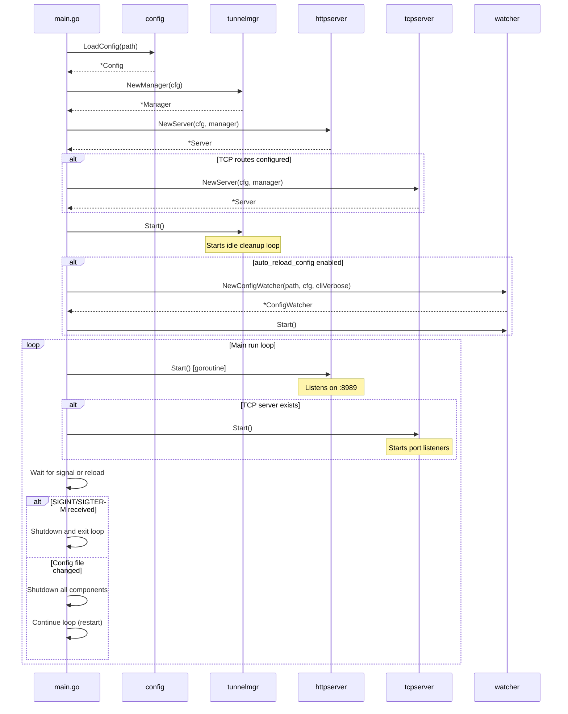
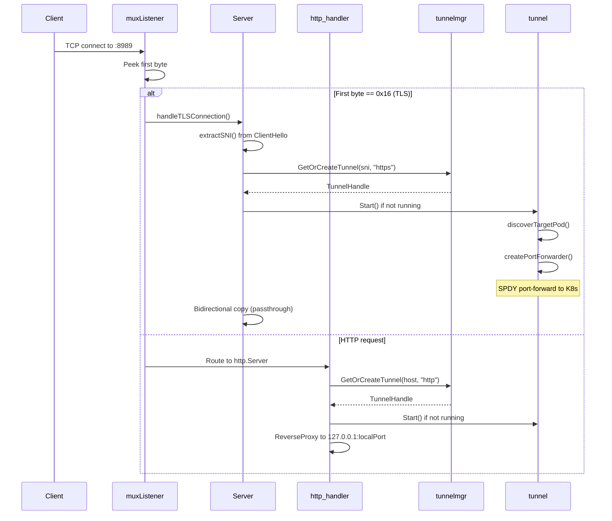
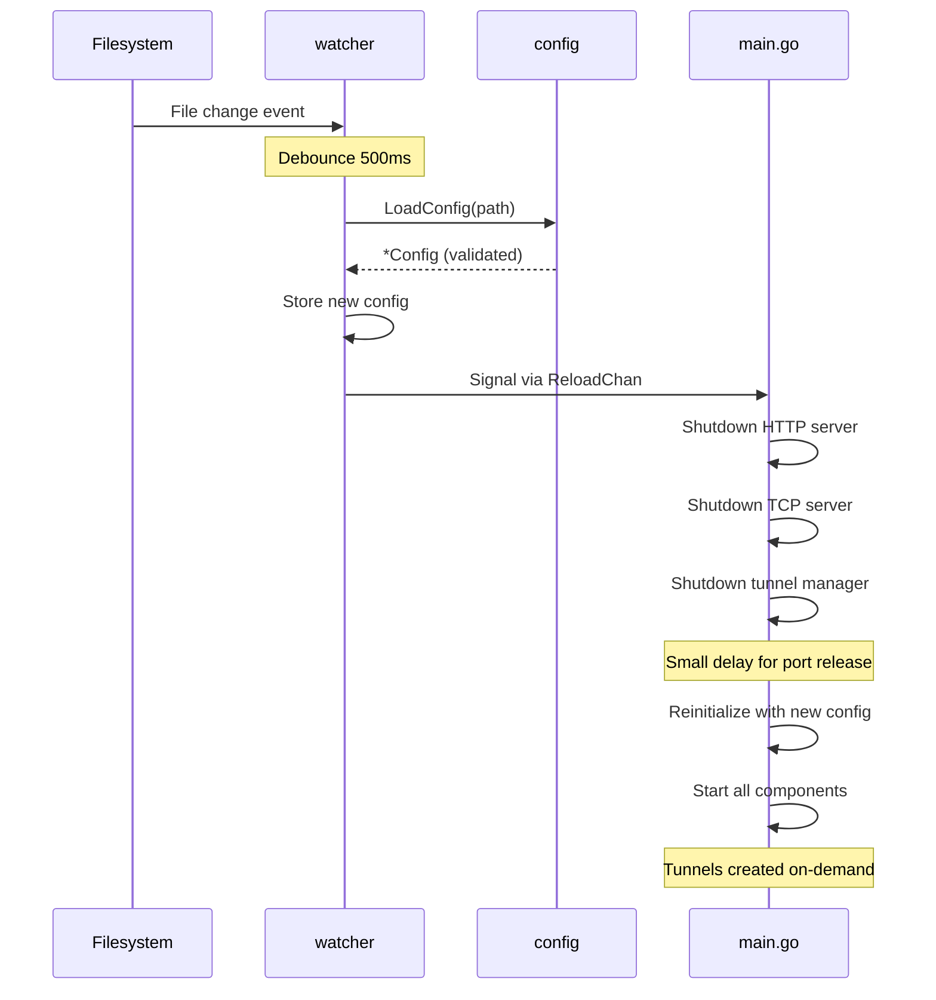
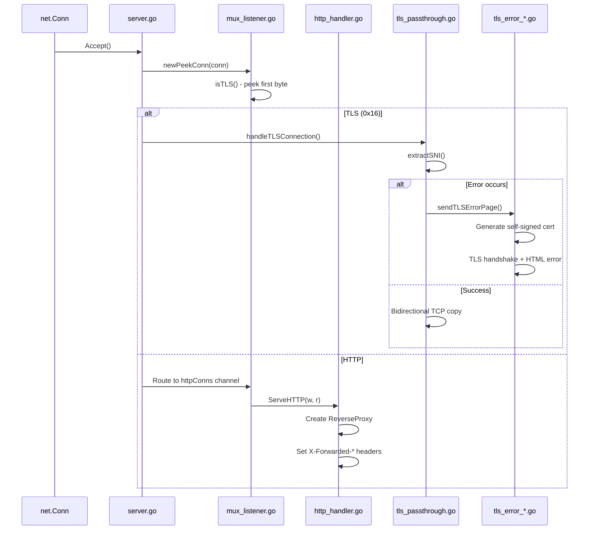
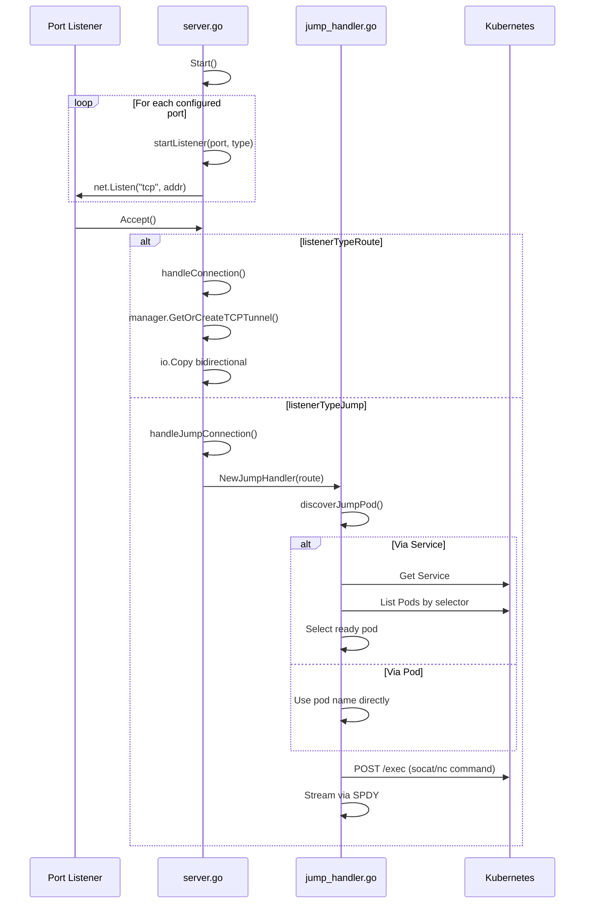
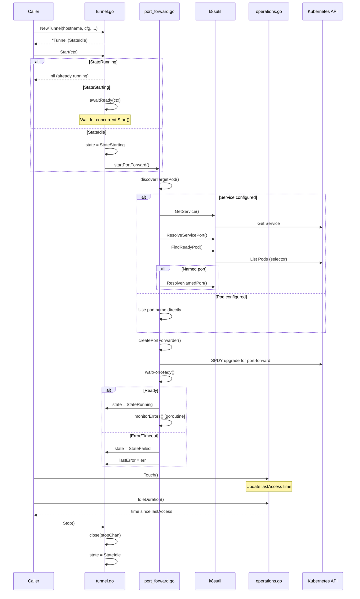
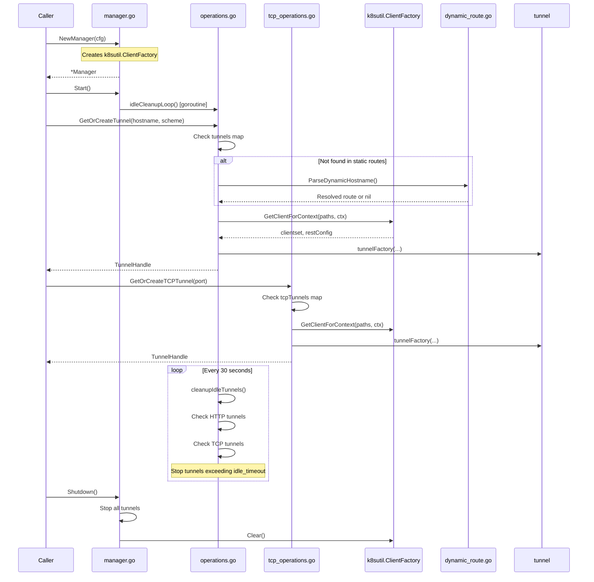
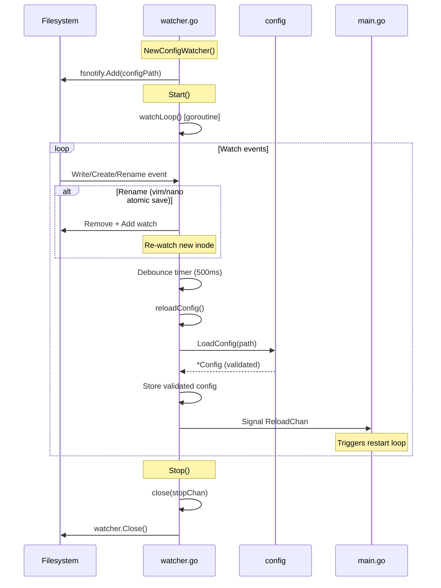
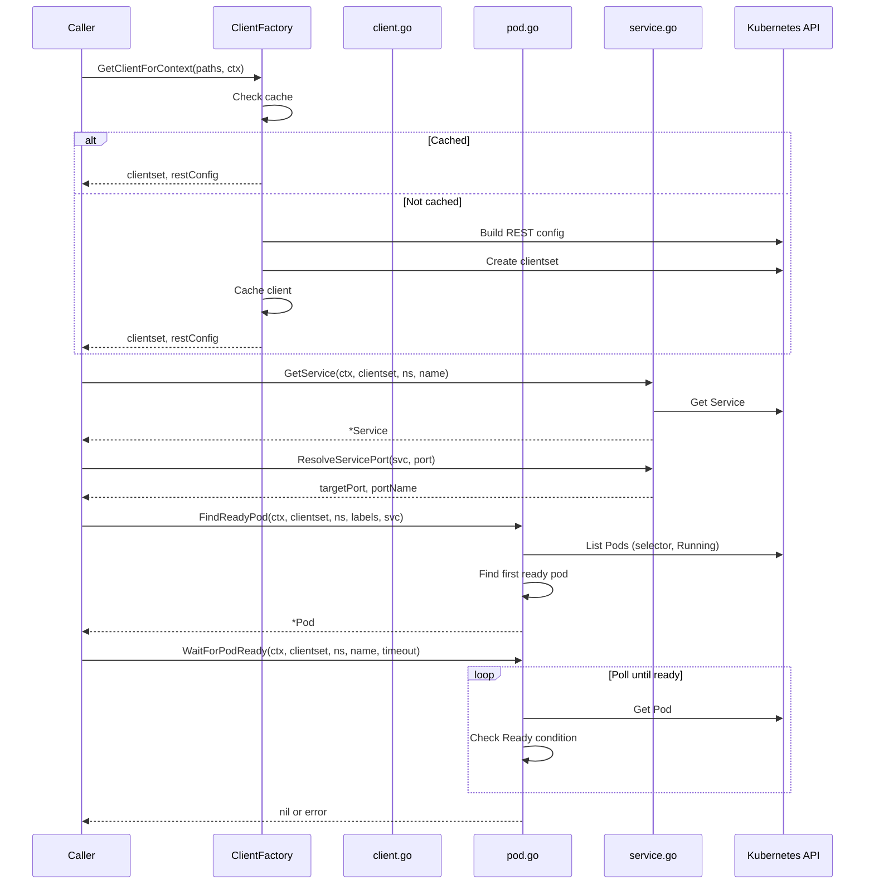

# Internal Package Architecture

This document explains how the internal packages interact with each other, starting from `main.go`.

## High-Level Architecture

### Startup Flow



### Request Flow (HTTP)



### Request Flow (TCP)


### Config Reload Flow

The config reload mechanism uses a full-restart approach for simplicity:



---

## Package Details

### config

Handles YAML configuration parsing and validation.


| File | Purpose |
|------|---------|
| `config.go` | `LoadConfig()`, kubeconfig resolution |
| `types.go` | All struct definitions (`Config`, `HTTPConfig`, `K8sRouteConfig`, etc.) |
| `defaults.go` | `DefaultConfig()` with sensible defaults |
| `validate.go` | `Validate()` method, route validation |
| `operations.go` | `PrintRoutes()`, `ShouldAutoReload()`, helper methods |
| `execpath.go` | `ExpandExecPath()` for systemd/launchd PATH issues |

---

### httpserver

Handles HTTP reverse proxy and TLS passthrough on a single port.



| File | Purpose |
|------|---------|
| `server.go` | `Server` struct, `Start()`, `Shutdown()`, connection routing |
| `mux_listener.go` | `peekConn` (peek without consuming), `muxListener` (routes HTTP vs TLS) |
| `http_handler.go` | `ServeHTTP()` - reverse proxy with header injection |
| `tls_passthrough.go` | `handleTLSConnection()`, `extractSNI()` - raw TCP forwarding |
| `tls_error_handler.go` | `sendTLSErrorPage()` - user-friendly TLS error pages |
| `tls_error_cert.go` | Dynamic self-signed certificate generation for error pages |
| `tls_error_page.go` | HTML template for TLS error pages |

---

### tcpserver

Handles raw TCP port forwarding and socat/jump-host connections.



| File | Purpose |
|------|---------|
| `server.go` | `Server` struct, listener management, connection handling |
| `jump_handler.go` | `JumpHandler` - kubectl exec + socat/nc for jump-host routing |
| `types.go` | `Manager` interface for dependency injection |

---

### tunnel

Individual port-forward tunnel using client-go SPDY. Uses `k8sutil` for pod/service resolution.



| File | Purpose |
|------|---------|
| `tunnel.go` | `Tunnel` struct, state machine, `Start()`/`Stop()`/`awaitReady()` |
| `port_forward.go` | `discoverTargetPod()`, `createPortForwarder()`, `waitForReady()` - uses `k8sutil` for resolution |
| `operations.go` | `Touch()`, `IdleDuration()`, `LocalPort()`, `Scheme()`, accessor methods |

---

### tunnelmgr

Manages tunnel lifecycle and idle cleanup. Uses `k8sutil.ClientFactory` for K8s client caching.



| File | Purpose |
|------|---------|
| `manager.go` | `Manager` struct, `NewManager()`, `Start()`, `Shutdown()`, owns `k8sutil.ClientFactory` |
| `operations.go` | `GetOrCreateTunnel()`, `idleCleanupLoop()`, HTTP tunnel management |
| `tcp_operations.go` | `GetOrCreateTCPTunnel()`, TCP tunnel management |
| `dynamic_route.go` | `ParseDynamicHostname()` - pattern-based route resolution |
| `types.go` | `TunnelHandle` interface, `TunnelFactory` type |

---

### watcher

Watches config file for changes and signals main.go to restart.



| File | Purpose |
|------|---------|
| `watcher.go` | `ConfigWatcher` struct, fsnotify integration, debouncing, `ReloadChan` signaling |

---

### k8sutil

Shared Kubernetes client utilities extracted from tunnelmgr for reuse.



| File | Purpose |
|------|---------|
| `client.go` | `ClientFactory` - caches Kubernetes clients per context |
| `pod.go` | `FindReadyPod()`, `WaitForPodReady()` - pod discovery utilities |
| `service.go` | `GetService()`, `ResolveServicePort()`, `ResolveNamedPort()` - service utilities |

---

### netutil

Shared network utilities for connection handling.

| File | Purpose |
|------|---------|
| `copy.go` | `BidirectionalCopy()` - copies data between two connections with proper TCP half-close handling |

---

## Dependency Graph

```
main.go
├── config          (loaded first, no internal deps)
├── k8sutil         (depends on: k8s client-go)
├── netutil         (no dependencies)
├── tunnelmgr       (depends on: config, tunnel, k8sutil)
│   └── tunnel      (depends on: config, k8sutil)
├── httpserver      (depends on: config, tunnelmgr, netutil)
├── tcpserver       (depends on: config, tunnelmgr, k8sutil, netutil)
└── watcher         (depends on: config only, signals main.go via ReloadChan)
```

## State Machines

### Tunnel States

```
    ┌─────────┐
    │  Idle   │◄─────────────────┐
    └────┬────┘                  │
         │ Start()               │ Stop() or error
         ▼                       │
    ┌─────────┐                  │
    │Starting │──────────────────┤
    └────┬────┘   timeout/fail   │
         │                       │
    ┌────┴────┐                  │
    │         │                  │
    ▼         ▼                  │
 ready     error                 │
    │         │                  │
    ▼         ▼                  │
┌───────┐ ┌────────┐             │
│Running│ │ Failed │─────────────┤
└───┬───┘ └────────┘             │
    │         ▲                  │
    │ Stop()  │ error            │
    ▼         │                  │
┌─────────┐   │                  │
│Stopping │───┴──────────────────┘
└─────────┘
```

**Concurrent Start() Handling:**

When multiple goroutines call `Start()` concurrently:
1. First caller transitions from `Idle` → `Starting` and performs startup
2. Subsequent callers see `StateStarting` and call `awaitReady()`
3. `awaitReady()` polls state every 100ms until:
   - `StateRunning`: returns success
   - `StateFailed`: returns the stored error
   - `StateIdle`: retries `Start()` (first caller failed, cleaned up)

**State Preservation:**

The manager only removes tunnels from its map when they are in `StateFailed` or `StateStopping`.
Tunnels in `StateStarting`, `StateIdle`, or `StateRunning` are preserved to handle concurrent access.

### Connection Routing

```
Incoming Connection (:8989)
         │
         ▼
    ┌─────────┐
    │Peek byte│
    └────┬────┘
         │
    ┌────┴────┐
    │         │
    ▼         ▼
  0x16      other
  (TLS)     (HTTP)
    │         │
    ▼         ▼
┌───────┐ ┌───────┐
│Extract│ │Reverse│
│  SNI  │ │ Proxy │
└───┬───┘ └───┬───┘
    │         │
    ▼         ▼
┌───────────────────┐
│GetOrCreateTunnel()│
└─────────┬─────────┘
          │
          ▼
    ┌───────────┐
    │Forward to │
    │ localhost │
    │   :port   │
    └───────────┘
```
