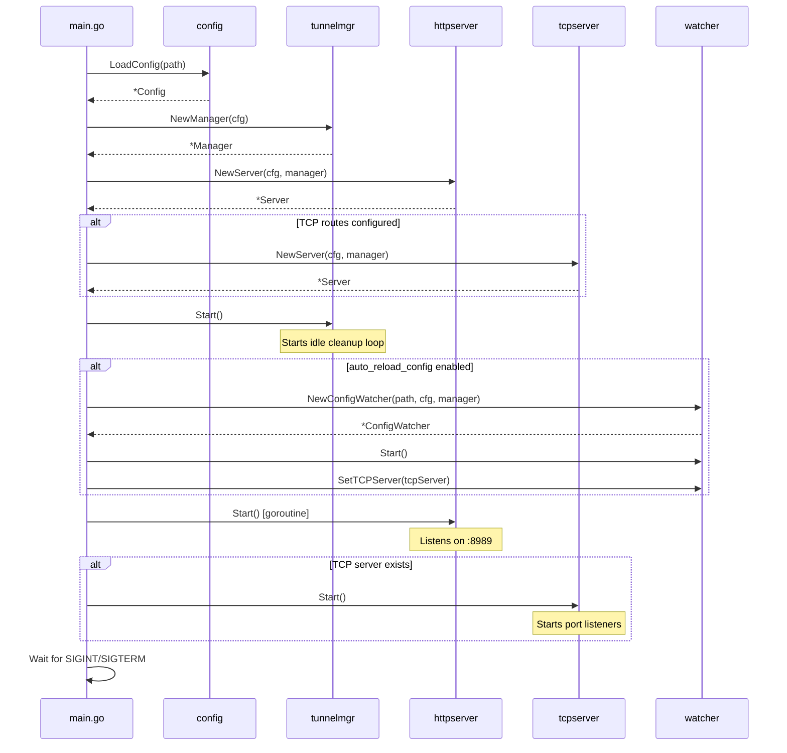
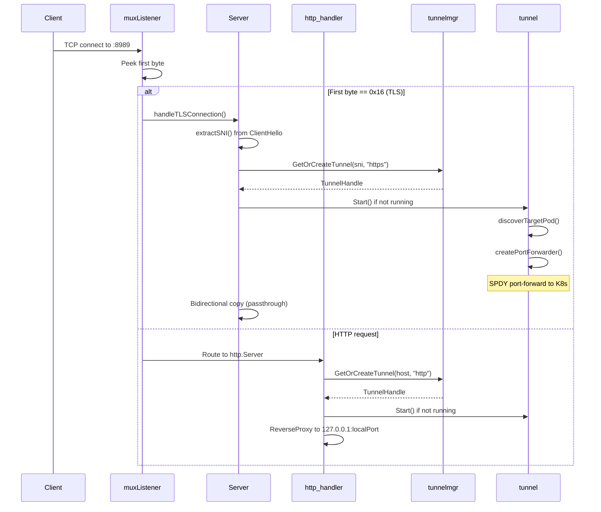
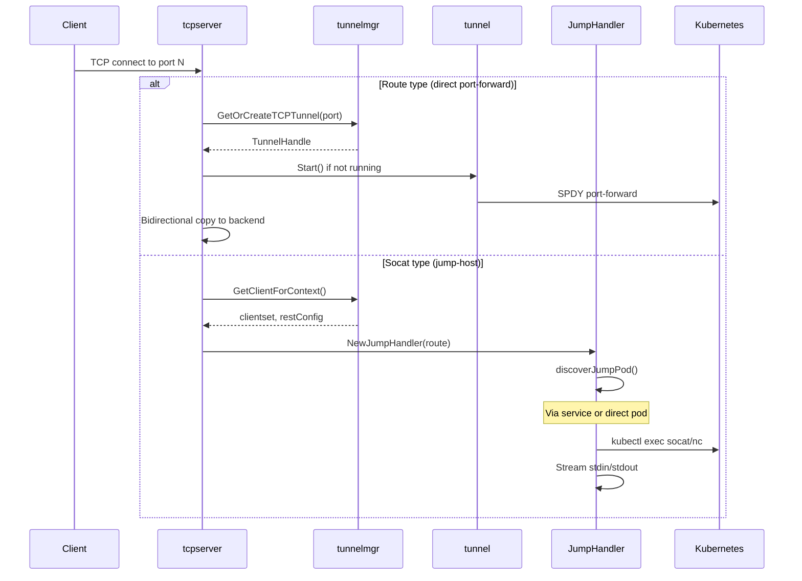
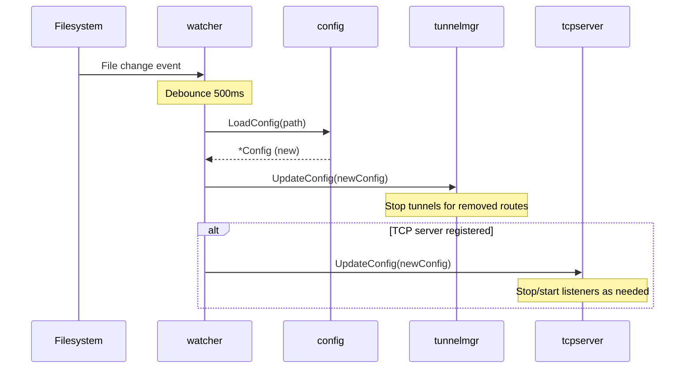
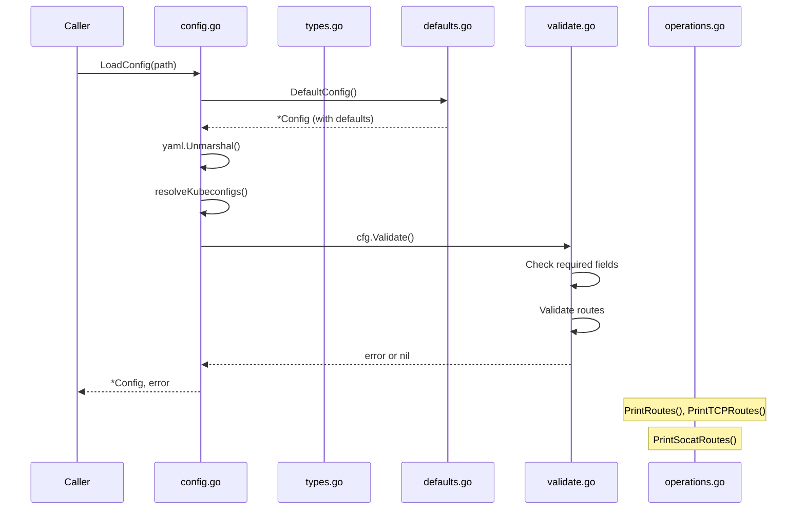
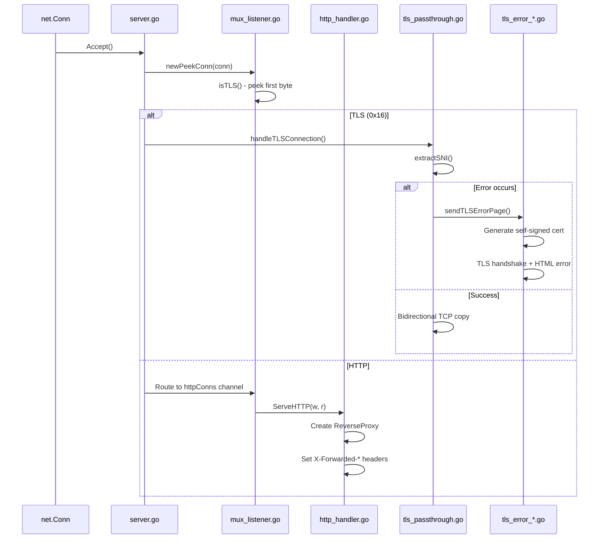
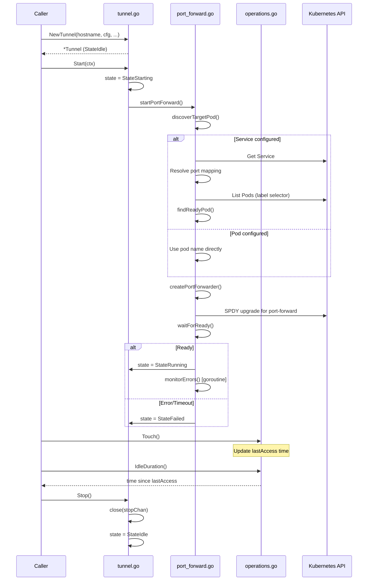
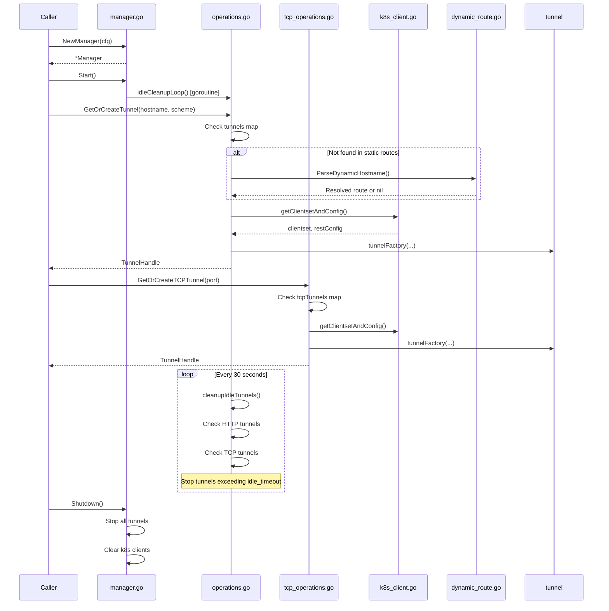
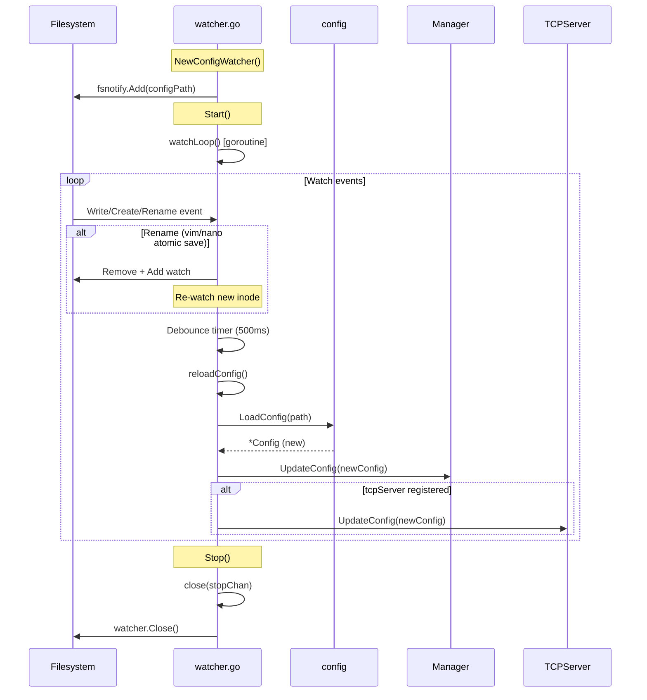

# Internal Package Architecture

This document explains how the internal packages interact with each other, starting from `main.go`.

## High-Level Architecture

### Startup Flow



### Request Flow (HTTP)



### Request Flow (TCP)



### Config Reload Flow



---

## Package Details

### config

Handles YAML configuration parsing and validation.



| File | Purpose |
|------|---------|
| `config.go` | `LoadConfig()`, kubeconfig resolution |
| `types.go` | All struct definitions (`Config`, `HTTPConfig`, `K8sRouteConfig`, etc.) |
| `defaults.go` | `DefaultConfig()` with sensible defaults |
| `validate.go` | `Validate()` method, route validation |
| `operations.go` | `PrintRoutes()`, `ShouldAutoReload()`, helper methods |
| `execpath.go` | `ExpandExecPath()` for systemd/launchd PATH issues |

---

### httpserver

Handles HTTP reverse proxy and TLS passthrough on a single port.



| File | Purpose |
|------|---------|
| `server.go` | `Server` struct, `Start()`, `Shutdown()`, connection routing |
| `mux_listener.go` | `peekConn` (peek without consuming), `muxListener` (routes HTTP vs TLS) |
| `http_handler.go` | `ServeHTTP()` - reverse proxy with header injection |
| `tls_passthrough.go` | `handleTLSConnection()`, `extractSNI()` - raw TCP forwarding |
| `tls_error_handler.go` | `sendTLSErrorPage()` - user-friendly TLS error pages |
| `tls_error_cert.go` | Dynamic self-signed certificate generation for error pages |
| `tls_error_page.go` | HTML template for TLS error pages |

---

### tcpserver

Handles raw TCP port forwarding and socat/jump-host connections.


| File | Purpose |
|------|---------|
| `server.go` | `Server` struct, listener management, connection handling, `UpdateConfig()` |
| `jump_handler.go` | `JumpHandler` - kubectl exec + socat/nc for jump-host routing |
| `types.go` | `Manager` interface for dependency injection |

---

### tunnel

Individual port-forward tunnel using client-go SPDY.



| File | Purpose |
|------|---------|
| `tunnel.go` | `Tunnel` struct, state machine (`Idle`→`Starting`→`Running`→`Stopping`), `Start()`/`Stop()` |
| `port_forward.go` | `discoverTargetPod()`, `createPortForwarder()`, `waitForReady()`, pod/service resolution |
| `operations.go` | `Touch()`, `IdleDuration()`, `LocalPort()`, `Scheme()`, accessor methods |

---

### tunnelmgr

Manages tunnel lifecycle, K8s client caching, and idle cleanup.



| File | Purpose |
|------|---------|
| `manager.go` | `Manager` struct, `NewManager()`, `Start()`, `Shutdown()`, `UpdateConfig()` |
| `operations.go` | `GetOrCreateTunnel()`, `idleCleanupLoop()`, HTTP tunnel management |
| `tcp_operations.go` | `GetOrCreateTCPTunnel()`, TCP tunnel management |
| `k8s_client.go` | `getClientsetAndConfig()` - cached K8s client per context |
| `dynamic_route.go` | `ParseDynamicHostname()` - pattern-based route resolution |
| `types.go` | `TunnelHandle` interface, `TunnelFactory` type |

---

### watcher

Watches config file for changes and triggers hot reload.



| File | Purpose |
|------|---------|
| `watcher.go` | `ConfigWatcher` struct, fsnotify integration, debouncing, `reloadConfig()` |

---

## Dependency Graph

```
main.go
├── config          (loaded first, no internal deps)
├── tunnelmgr       (depends on: config, tunnel)
│   └── tunnel      (depends on: config, k8s client-go)
├── httpserver      (depends on: config, tunnelmgr)
├── tcpserver       (depends on: config, tunnelmgr)
└── watcher         (depends on: config, tunnelmgr, tcpserver)
```

## State Machines

### Tunnel States

```
    ┌─────────┐
    │  Idle   │◄─────────────────┐
    └────┬────┘                  │
         │ Start()               │ Stop() or error
         ▼                       │
    ┌─────────┐                  │
    │Starting │──────────────────┤
    └────┬────┘   timeout/fail   │
         │                       │
         │ ready                 │
         ▼                       │
    ┌─────────┐                  │
    │ Running │──────────────────┤
    └────┬────┘   Stop()         │
         │                       │
         ▼                       │
    ┌─────────┐                  │
    │Stopping │──────────────────┘
    └─────────┘
```

### Connection Routing

```
Incoming Connection (:8989)
         │
         ▼
    ┌─────────┐
    │Peek byte│
    └────┬────┘
         │
    ┌────┴────┐
    │         │
    ▼         ▼
  0x16      other
  (TLS)     (HTTP)
    │         │
    ▼         ▼
┌───────┐ ┌───────┐
│Extract│ │Reverse│
│  SNI  │ │ Proxy │
└───┬───┘ └───┬───┘
    │         │
    ▼         ▼
┌───────────────────┐
│GetOrCreateTunnel()│
└─────────┬─────────┘
          │
          ▼
    ┌───────────┐
    │Forward to │
    │ localhost │
    │   :port   │
    └───────────┘
```
